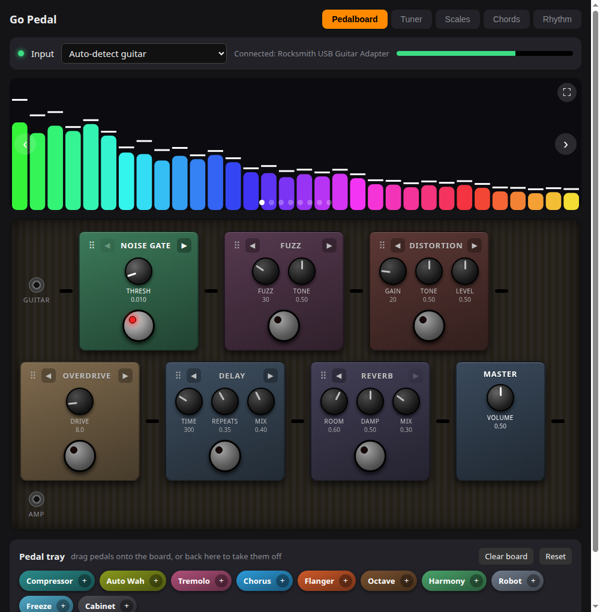
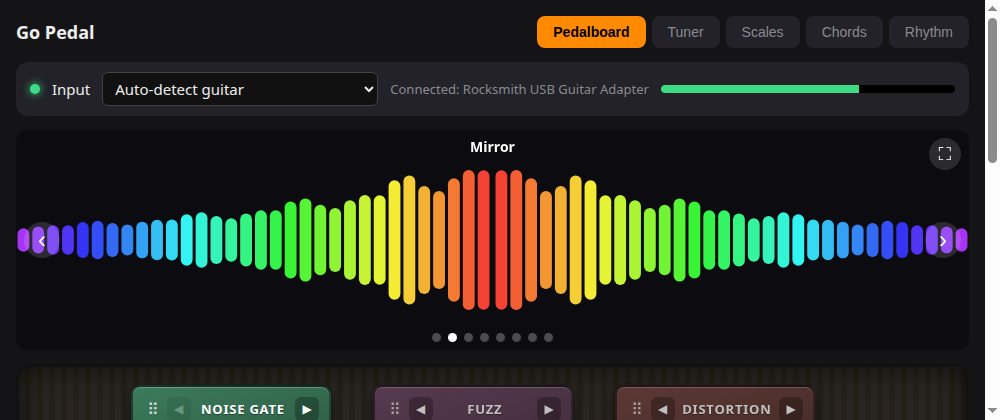
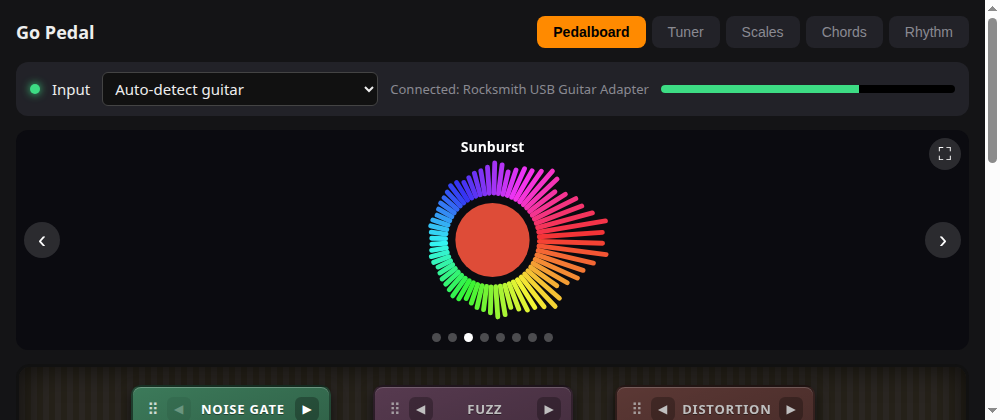
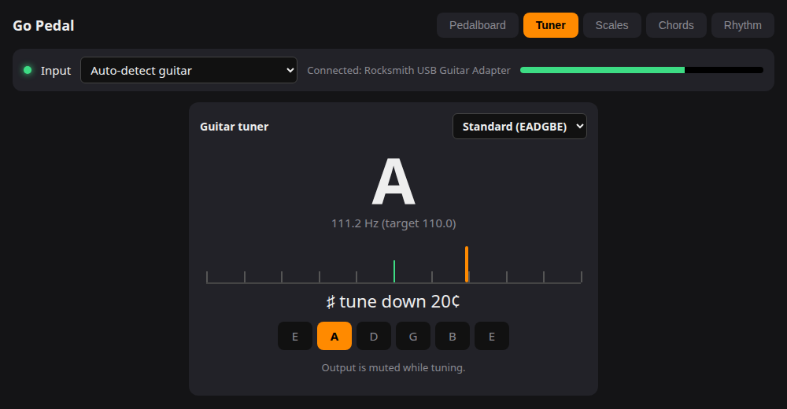
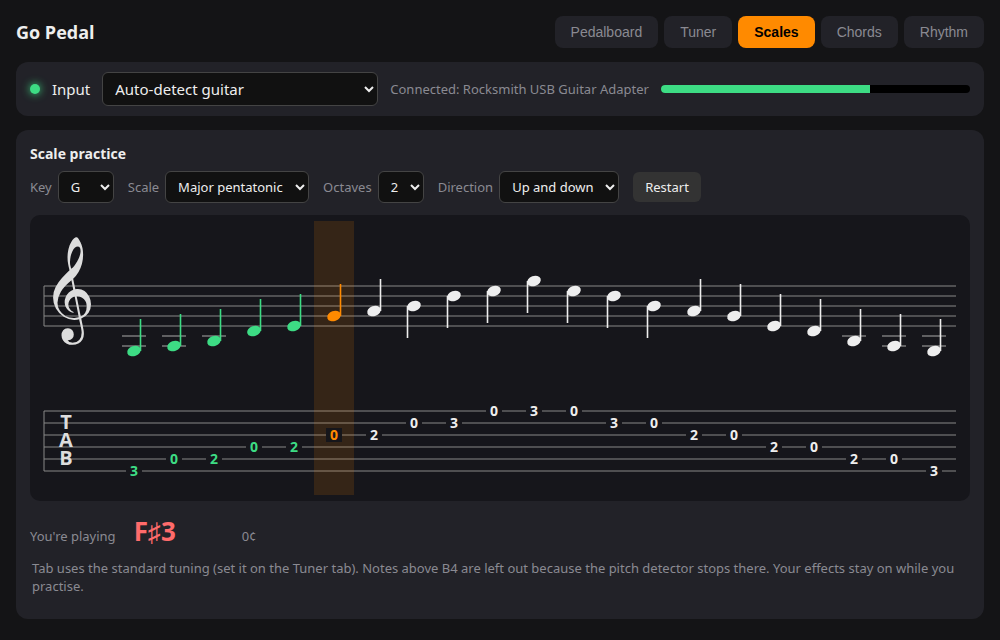
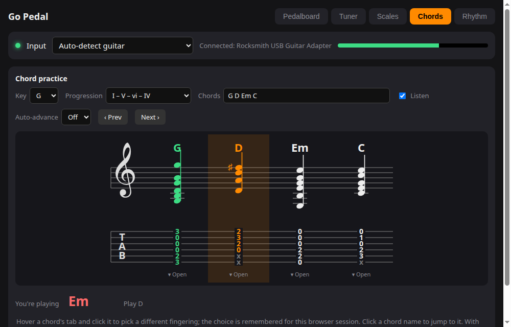
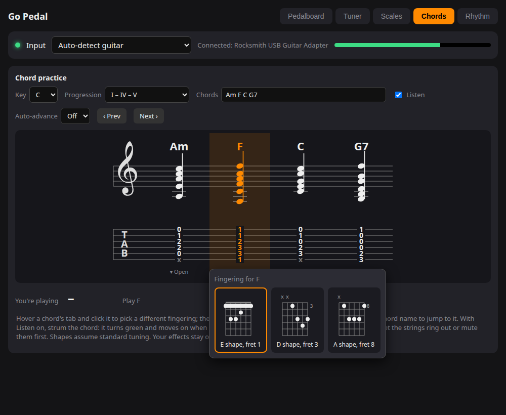
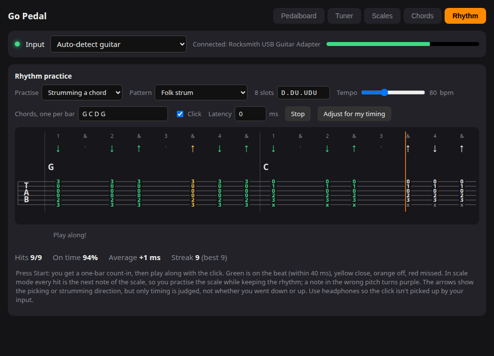
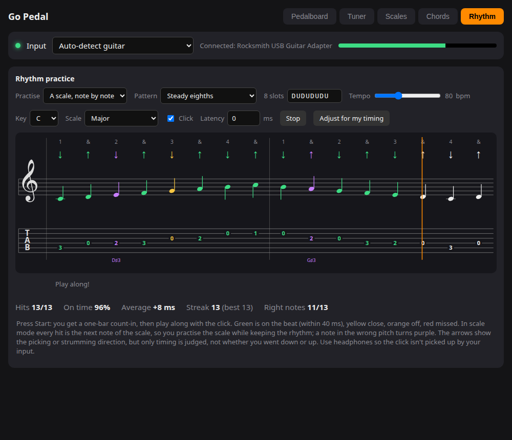

# effects

A software guitar pedal written in Go, with a web UI, a tuner, and a set of practice tools
that listen to you play: scales, chords and rhythm, each shown as standard notation with guitar tab underneath.
Plug a guitar into a USB audio interface, run it, and use it from your browser.



> **Work in progress.** This is a hobby project that I'm building for fun and sharing
> because it's cool. Expect rough edges, missing features and breaking changes.
> Issues and PRs are welcome!

> **About the screenshots:** they are the real UI, captured without a guitar attached, so the
> audio-driven parts (spectrum, tuner reading, heard notes and chords, strum timing) are simulated
> to show what each screen looks like in use.

## Features

### Pedalboard

16 pedals with dials and footswitches: noise gate, fuzz, distortion, overdrive, delay, reverb,
compressor, auto wah, tremolo, chorus, flanger, octave, harmony, robot (ring mod), freeze and cabinet sim.
Drag pedals between the board and the tray (or use ◀ ▶) to build and order your signal chain.
Your board (order, on/off states and knob settings) is remembered between runs.

There are 8 scrollable visualizers above the board (← →, full screen with F):

 

### Tuner

Pitch detection (YIN) that snaps to the nearest string, with Standard, Drop D and Half-step-down tunings.
Output is muted while tuning.



### Scale practice

Pick a key and a scale (major, natural minor, major and minor pentatonic, blues), 1 or 2 octaves, up or up-and-down.
The notes are shown in treble clef with the tab lined up underneath. Play the scale: the pitch detector hears each
note, turns it green and moves on. Fingerings are chosen to keep your hand movement small, and the tab follows
the tuning you pick on the Tuner tab. Your effects stay on while you practise.



### Chord practice

Pick a key and a progression (I–IV–V, I–V–vi–IV, ii–V–I, 12-bar blues, and more), or type your own chords such as
`C G Am F` or `Fmaj7 Dm7 G7`. Each chord is shown as notation with its tab, starting with the most common shape
(open C, a barre at fret 1 for F, and so on).

Hover a chord's tab and click it to pick a different fingering (open, E, A and D shapes); the choice is remembered
for the browser session.

 

With **Listen** on, strum the chord and it recognises it (major, minor, 7, maj7, m7, sus2, sus4), turns green and
moves on. If the next chord is the same one, let the strings ring out or mute them first.

### Rhythm practice

Pick a strumming pattern (quarters, steady eighths, folk strum, driving rock, reggae offbeats, syncopated, or type
your own 8 slots), a tempo, and what to play:

- **Strumming a chord:** a chord per bar with its tab at each hit.
- **A scale, note by note:** every hit is the next note of the scale, in notation and tab, so you practise the scale
  while keeping the rhythm. The pitch is checked too, and a wrong note turns purple with what you actually played.

You get a one-bar count-in and a click, then a moving playhead. Each hit is timed against the beat: green is within
40 ms, yellow is close, orange is off, red is missed. You also get your on-time percentage, average early or late
error, and streak. "Adjust for my timing" shifts the timing by your average error if you are always a bit early or late.

 

The arrows show the strumming or picking direction, but only timing is judged, not whether you went down or up.
Use headphones so the click isn't picked up by your input.

### Everything else

- **Input selector:** pick the capture device in the UI; the guitar is auto-detected and reconnects when you replug it.
- **No cgo, no dependencies:** just the Go standard library.

## Requirements

- Linux with PipeWire or PulseAudio (uses `parec` and `pacat`)
- Go 1.22+
- A guitar audio input. It is developed against a Rocksmith USB Guitar Adapter, but any input works.

## Run it

```sh
go build -o pedal .
./pedal
```

Then open <http://127.0.0.1:8765>.

Find your device names with `pactl list short sources` and `pactl list short sinks`:

```sh
./pedal -in <source-name> -out <sink-name> -addr 127.0.0.1:8765
```

By default the guitar interface is auto-detected (or pick a device in the UI). Use headphones, or keep the volume low, to avoid feedback.

Your pedalboard is saved to `~/.config/effects/state.json`. Use `-state <path>` to keep it somewhere else, or `-state ""` to turn saving off.

Run the tests with `go test ./...`.

## How it works

Audio is piped through `parec` and `pacat` (10 ms buffers) and processed in 128-sample blocks.
Expect roughly 20-40 ms of round-trip latency. Getting this lower (JACK/PipeWire directly) is on the wish list.

The practice tools use the raw input, before your effects:

- **Pitch** (scales, tuner): YIN on the last ~85 ms.
- **Chords:** an FFT of the last ~0.34 s is folded into a 12-note chromagram and matched against chord templates, with a bonus for the lowest note being the root.
- **Rhythm:** the server timestamps each note or strum it hears (a jump in energy above ~450 Hz, so a new strum stands out over a ringing chord) and the browser plays the click and times every hit against it.

| File | What it does |
| --- | --- |
| `main.go` | Audio loop, parameters, gate / fuzz / distortion / overdrive / delay |
| `effects.go` | Tremolo, chorus, wah, octave, cabinet, compressor, flanger, harmony, ring mod, freeze |
| `spectrum.go`, `audio.go` | Visualizer spectrum, capture device detection |
| `reverb.go` | Freeverb-style reverb |
| `tuner.go` | YIN pitch detection and guitar tunings |
| `chord.go` | Chord recognition (FFT, chromagram, template matching) |
| `onset.go` | Note and strum onset detection, for rhythm timing |
| `state.go` | Saving and loading the pedalboard |
| `server.go`, `index.html` | Web server and UI, including the notation, tab, chord shapes and rhythm judging, which run in the browser |

## Limitations

- Pitch detection tops out around B4 (500 Hz), so scales leave out higher notes.
- Chord shapes assume standard tuning, and power chords, 6ths, 9ths and slash chords aren't recognised.
- Rhythm practice judges timing, not strum direction, and doesn't check which chord you played.

## Ideas / TODO

- Lower latency audio backend
- More effects (phaser, reverse)
- Presets
- Better tuner smoothing

## License

[MIT](LICENSE)
